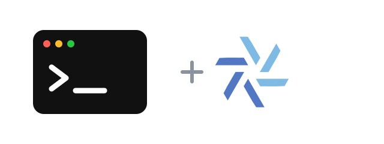

<p align="center">
  
</p>

<h1 align="center">agent-browser-flake</h1>

<p align="center">
  <a href="flake.nix"></a>
  <a href="LICENSE"></a>
  <a href="https://github.com/vercel-labs/agent-browser/releases/tag/v0.38.1"></a>
</p>

[agent-browser](https://github.com/vercel-labs/agent-browser) is a fast browser automation CLI for AI agents.

This flake packages the official native Linux binary and supplies Chromium declaratively. There is no npm runtime and no separate `agent-browser install` browser download. It supports x86_64 and ARM64 Linux.

```sh
nix run github:Fractal-Tess/agent-browser-flake -- --version
```

## Install in a Nix configuration

Add the flake input:

```nix
inputs.agent-browser-flake.url = "github:Fractal-Tess/agent-browser-flake";
```

Use the NixOS or Home Manager module:

```nix
# NixOS
{
  imports = [ inputs.agent-browser-flake.nixosModules.default ];
  programs.agent-browser.enable = true;
}

# Home Manager
{
  imports = [ inputs.agent-browser-flake.homeManagerModules.default ];
  programs.agent-browser.enable = true;
}
```

The module defaults to the flake package. Override `programs.agent-browser.package` if needed, or use `overlays.default` to expose `pkgs.agent-browser`.

Because the package is immutable, update it through the flake rather than with `agent-browser upgrade`.

## Update

The daily [update workflow](.github/workflows/update.yml) runs at 12:00 UTC, checks the latest stable release, refreshes both Linux hashes, validates the package, and commits an update. Run the same process locally with:

```sh
./scripts/update.sh
```

Pass a stable version such as `./scripts/update.sh 0.38.1` to update to a specific release. The workflow can also be started manually from GitHub Actions.

## Credits

[GitHub](https://github.com/Fractal-Tess/agent-browser-flake)

The flake packaging is [MIT](LICENSE). agent-browser is [Apache-2.0 licensed](https://github.com/vercel-labs/agent-browser/blob/main/LICENSE), © Vercel, Inc.

The lockup includes the [Nix snowflake](https://github.com/NixOS/nixos-artwork/tree/master/logo) by Simon Frankau and Tim Cuthbertson ([CC BY 4.0](https://creativecommons.org/licenses/by/4.0)).
